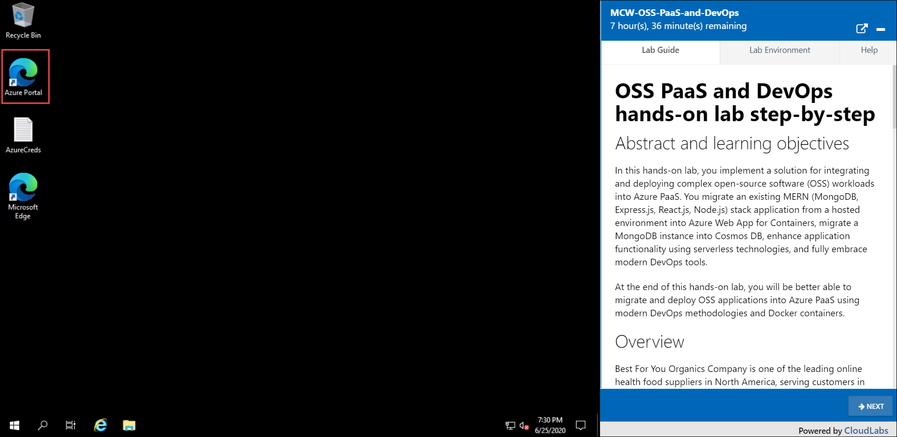
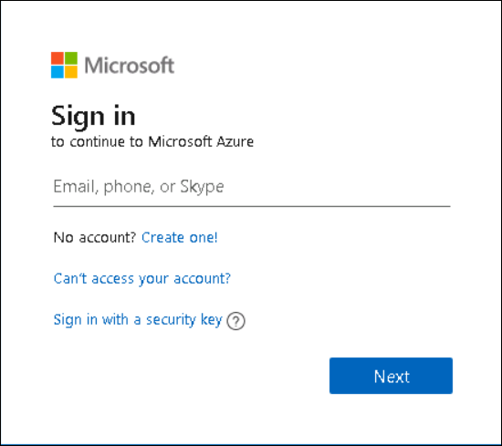

# Getting Started #
## **Azure subscription and OSS-PaaS-and-DevOps environment** ##
Once the environment is provisioned, a virtual machine and labguide will get loaded in your browser. For getting the lab environment details you can select Lab Environment tab. Additionally, The credentials will also be emailed to the email address entered at registration.

 
 
## **Login to the web console** ##
In the JumpVM Open Azure portal

 
Now, you will see a your browser window, in that enter the following credentials to login the azure portal.

* Azure Usename/Email: <inject key="AzureAdUserEmail"></inject>
* Azure Password: <inject key="AzureAdUserPassword"></inject>

