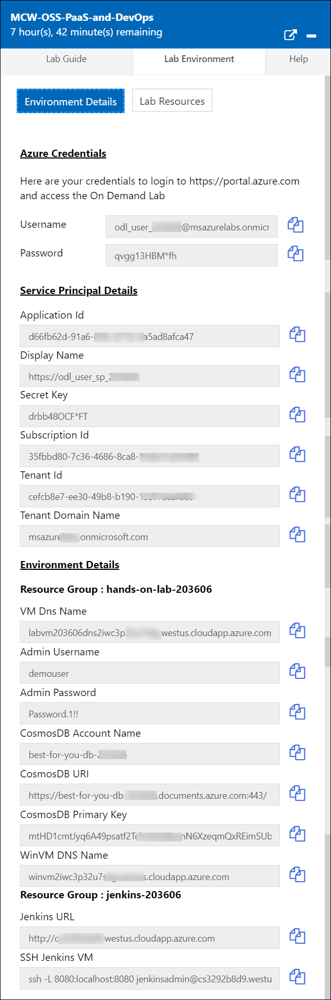

# Getting Started #
## **Azure subscription and OSS-PaaS-and-DevOps environment** ##
Once the environment is provisioned, a virtual machine and labguide will get loaded in your browser. For getting the lab environment details you can select Lab Environment tab. Additionally, The credentials will also be emailed to the email address entered at registration.

 
