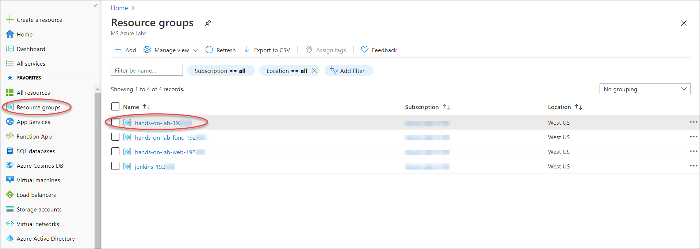
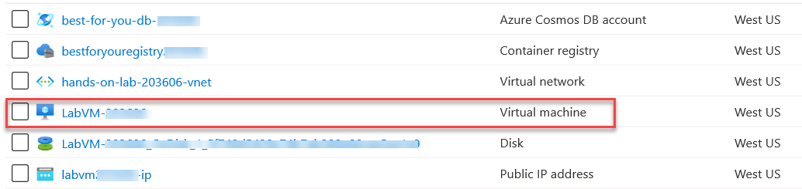

## Exercise 1: Run starter application

Duration: 30 minutes

In this exercise, you create a local copy of the starter application on your Lab VM, add some sample data to the local MongoDB database, and run the application.

### Task 1: Connect to your Lab VM

1. In the **Azure portal**, select **Resource groups** from the Azure services list.

    

2. Select the **hands-on-lab-SUFFIX** resource group from the list.

    

    > **Tip**: If there are too many resource groups you can enter "hands-on-lab" into the filter box to reduce the resource groups displayed the list.

3. Next, select **LabVM** from the list of available resources.

    

4. On the **LabVM** blade, copy the Public IP address from the Essentials area on the Overview screen.

    

5. Open a Remote Desktop Client (RDP) application and enter or paste the Public IP address of your Lab VM into the computer name field.

6. Select **Connect** on the Remote Desktop Connection dialog.

7. Select **Yes** to connect, if prompted that the identity of the remote computer cannot be verified.

    

8. Enter the following credentials (or the non-default credentials if you changed them):

    - **Username:** demouser
    - **Password:** Password.1!!

    

9. Select **OK** to log into the Lab VM.

### Task 2: Grant permissions to Docker

In this task, you will grant permissions to the demouser account to access the Unix socket needed to communicate with the Docker engine.

1. On your Lab VM, open a **Bash** shell by selecting the Start menu, and then expanding Debian, Applications, and Shells.

    

2. At the command prompt, enter the following command:

    ```bash
    sudo usermod -a -G docker $USER
    ```

3. After running the command, you will need **completely log out of the Lab VM** and log back in (if in doubt, reboot).

4. After logging back in, run the following command to test that the demouser account has proper permissions:

    ```bash
    docker run hello-world
    ```

    

### Task 3: Integrate GitHub into VS Code

In this task, you will install the GitHub extension in VS Code, and configure a service integration with your GitHub account. This integration will allow you to push your code changes to GitHub directly from VS Code.

1. On your Lab VM, open **VS Code** under Programming on the Start menu.

    

2. In VS Code, select the **Extensions** icon from the left-hand menu, enter "github" into the **Extensions** search box, and select the **GitHub** extension.

    

3. Select **Install** in the Extension: GitHub window.

    

4. To connect VS Code with your GitHub account, you need to generate a Personal access token.

5. Open a browser window and navigate to your GitHub account **https://<span></span>github.com.**

6. Within your GitHub account, select **your user profile icon** in the top right, then select **Settings** from the menu.

    

7. On the Settings screen, select **Developer settings** at the bottom of the Personal settings menu on the left-hand side of the screen.

    

8. On the Developer settings page, select **Personal access tokens** from the left-hand menu.

    

9. Select **Generate new token**.

    

10. Enter a token description, such as "VS Code Integration", and then check the box next to **repo** under **Select scopes**, which will select all the boxes under it.

    

11. Select **Generate token** near the bottom of the screen.

    

12. Select the **copy** button next to the token that is generated.

    

    >**Important**: Make sure you copy the new personal access token before you navigate away from the screen, or you will need to regenerate the token. Save the copied token by pasting it into a text editor for future reference. This will also be used as your password when pushing changes to GitHub.

13. Open **VS Code** on your Lab VM.

14. Select the **View** menu, then select **Command Palette** from the menu.

    

15. In the box that appears at the top center of the VS Code window, enter "Set Personal Access Token," then select **GitHub: Set Personal Access Token**, when it appears.

    

16. Paste the Personal access token you copied from GitHub into the box, and press **Enter**.

    

17. VS Code is now connected to your GitHub account.

18. Close VS Code.

### Task 4: Clone the starter application

In this task, you will clone the starter application, creating a local copy on your Lab VM.

1. On your Lab VM, open a browser, and navigate to your GitHub account **https://<span></span>github.com**.

2. Within your GitHub account, navigate to the forked copy of the `MCW-OSS-PaaS-and-Devops` application page, select **Clone or download**, then select the **copy** link next to the web URL.

    

3. Open a new bash shell, and enter the following command:

    ```bash
    cd ~
    ```

4. Next, enter the following command, replacing `[EMAIL]` with the email address you used when creating your GitHub account. This will associate your git email address with the commits made from the Lab VM.

    ```bash
    git config --global user.email "[EMAIL]"
    ```

    

5. At the prompt, enter the following command, replacing `[CLONE-URL]` with URL you copied from GitHub in step 2 above:

    ```bash
    git clone [CLONE-URL]
    ```

    

6. Now, change the directory to the cloned project by entering the following at the prompt:

    ```bash
    cd MCW-OSS-PaaS-and-DevOps
    ```

    

7. Finally, issue a command to open the starter project in VS Code by typing:

    ```bash
    code .
    ```

8. A new VS Code window will open, with the `MCW-OSS-PaaS-and-DevOps` folder opened.

    

9. You are now ready to begin working with the project in VS Code.

### Task 5: Launch the starter application

In this task, you will seed the MongoDB with sample data, then run the application locally, connected to your MongoDB instance. This task is to verify the connection to MongoDB and that it contains the seeded plan data, before we migrate the application and data to Azure Cosmos DB.

1. Return to VS Code, select **Terminal** from the menu, and select **New Terminal**.

    

2. This will open a new bash terminal window at the bottom of the VS Code dialog.

3. Change directories to the `Hands-on lab/lab-files` folder by running the following command. **Important**: Be sure to include the quotes around the path, since it contains a space.

    ```bash
    cd "Hands-on lab/lab-files"
    ```

4. At the bash prompt, use the `npm install` command to ensure the required components are installed on your Lab VM.

    ```bash
    sudo npm install
    ```

    

5. Next, enter the following to seed the local MongoDB database with plans, user accounts, and orders.

    ```bash
    node data/Seed.js
    ```

    

    >**Note**: If you receive an error that the service is not running, start the MongoDB service by executing the `sudo service mongod start` command at the shell prompt.

6. Next, build the application using the following:

    ```bash
    sudo npm run build
    ```

7. Finally, enter the following to start the web server for the application. You will see a `connection successful` message in the terminal window.

    ```bash
    npm start
    ```

8. Open a browser and navigate to **http://<span></span>localhost:3000** to view the landing page of the starter application. You will see three plans listed on the application home page, which are pulled from the local MongoDB database.

    

9. Return to the VS Code integrated terminal window, and press **CTRL+C** to stop the application.

 Now, click on the **Next** from lower right corner of your lab guide page to execute the next exercise.
