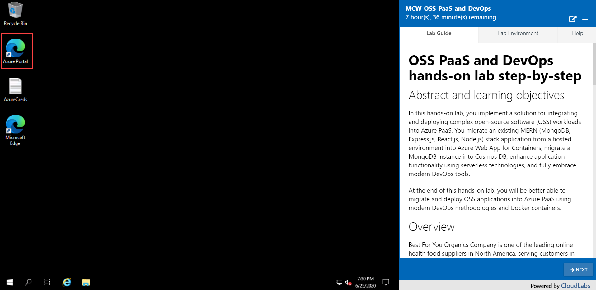

# Getting Started with Lab

Once the environment is provisioned, a virtual machine (JumpVM) and lab guide will get loaded in your browser. To get lab environment details, you can select Lab Environment tab. Additionally, The credentials will also be emailed to your email address provided at registration.

 
 
## Login to Azure Portal
1. In the JumpVM Open Azure portal shorcut created on desktop.

   
 
1. Now, you will see a your browser window, in that enter the following credentials to login the azure portal.

   * Azure Usename/Email: <inject key="AzureAdUserEmail"></inject>
   * Azure Password: <inject key="AzureAdUserPassword"></inject>

     

